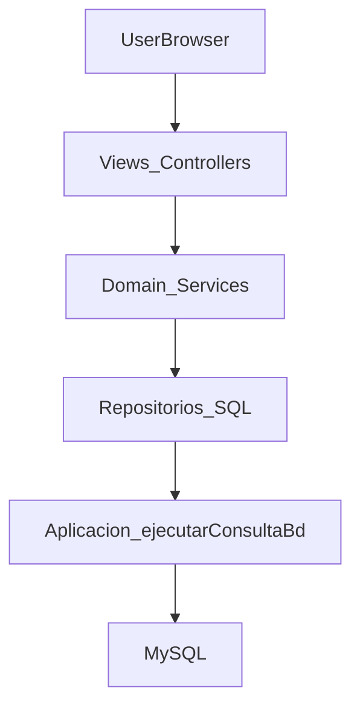

# Plan refactor: eliminar SQL de vistas

### Objetivo

- **Meta**: que las vistas/controladores (`*.php` en la raíz y scripts en `includes`) **no contengan SQL** ni usen directamente la conexión, sino que llamen a **métodos de clases de dominio/repositorios** que internamente utilizan `Aplicacion::ejecutarConsultaBd`.
- **Ámbito**: código PHP de la raíz del proyecto y formularios en `includes/clases`, manteniendo el esquema de BD actual.

---

## 1. Diseño de la nueva capa de dominio/repositorios

- **1.1. Revisar modelos y formularios existentes**
  - Reconfirmar el comportamiento actual de:
    - `includes/clases/Usuario.php` (login, búsqueda, CRUD).
    - Formularios de productos/categorías/pedidos ya existentes en `includes/clases`.
  - Identificar campos y relaciones clave en las tablas `Productos`, `Categorias`, `Pedidos`, `pedidos_productos` apoyándose en `mysql/bistro_fdi.sql`.
- **1.2. Definir nuevas clases de dominio/repositorio**
  - `**Producto`** (o `ProductoRepositorio`):
    - Métodos estáticos mínimos:
      - `Producto::todosOfertados()` → lista de productos ofertados con categoría (para `carta.php`).
      - `Producto::porIds(array $ids)` → productos por id para carrito y pago.
      - `Producto::porId(int $id)` → un producto (para edición y detalle).
      - (Opcional) métodos de escritura si se quiere que formularios los usen: `crear`, `actualizar`, `borrar`, `retirarDeCarta`.
  - `**Categoria`**:
    - `Categoria::todas()` → todas las categorías (para `index.php`, admin y formularios).
    - `Categoria::porId(int $id)` → una categoría concreta.
    - (Opcional) `crear`, `actualizar`, `borrar`.
  - `**Pedido**` (puede incluir también la lógica de líneas):
    - Lectura:
      - `Pedido::porUsuario(int $idUsuario)` → historial completo.
      - `Pedido::activosPorUsuario(int $idUsuario)` → estados activos del perfil.
      - `Pedido::historialPorUsuario(int $idUsuario)` → estados no activos.
      - `Pedido::porEstados(array $estados)` → para tablet de camarero/cocina.
      - `Pedido::detallesPedidos(array $idsPedidos)` → devuelve líneas (`pedidos_productos` + productos) agrupadas por pedido.
      - `Pedido::porIdYUsuario(int $idPedido, int $idUsuario)` → validación de propiedad (confirmación).
    - Escritura:
      - `Pedido::cambiarEstado(int $idPedido, string $nuevoEstado, ?int $idUsuario = null)` → para tablet, gestión y cancelaciones.
      - `Pedido::cancelarCliente(int $idPedido, int $idUsuario)` → encapsula la lógica específica de cancelación del cliente.
      - `Pedido::crearConLineas(int $idUsuario, string $tipo, string $metodoPago, array $lineas)` → encapsula la lógica actual de `pago.php` (número diario, inserción de pedido y líneas).
  - **Aprovechar `Usuario` existente**:
    - Añadir si hace falta métodos de actualización de perfil/registro para que los formularios no hagan SQL.
- **1.3. Convenciones internas**
  - Todas las clases de dominio usarán `Aplicacion::getInstance()->ejecutarConsultaBd(...)` exclusivamente.
  - Las clases podrán devolver:
    - Arrays asociativos simples (para integrarse con el HTML actual).
    - Objetos de dominio (`Usuario`, `Producto`, `Pedido`) donde ya exista la estructura (para usuarios ya está).
- **1.4. Diagrama de capas (conceptual)**

---

## 2. Adaptación progresiva de formularios a la capa de dominio

> Objetivo: que los `Formulario*` dejen de contener SQL y usen las nuevas clases. Esto reduce duplicación y mantiene la lógica de escritura en un solo sitio.

- **2.1. Formularios de productos**
  - `includes/clases/FormularioNuevoProducto.php`:
    - Sustituir las consultas de inserción por una llamada a `Producto::crear(...)`.
    - Sustituir la carga de categorías por `Categoria::todas()`.
  - `includes/clases/FormularioEditarProducto.php`:
    - Reemplazar `SELECT` de producto y categorías por `Producto::porId()` y `Categoria::todas()`.
    - Actualización final vía `Producto::actualizar(...)`.
- **2.2. Formularios de categorías**
  - `includes/clases/FormularioNuevaCategoria.php` y `includes/clases/FormularioEditarCategoria.php`:
    - Usar `Categoria::crear(...)` y `Categoria::actualizar(...)` en lugar de SQL directo.
- **2.3. Formularios de usuario**
  - `includes/clases/FormularioRegistro.php`:
    - Delegar en `Usuario` (extender con métodos si es necesario) o en un `UsuarioRepositorio` para la inserción.
  - `includes/clases/FormularioPerfil.php`:
    - Añadir a `Usuario` un método `actualizarPerfil(...)` que reciba nombre, apellidos, email, avatar y haga el `UPDATE`.

> Nota: aunque el usuario te pedía principalmente sacar SQL de las vistas, aprovechar esta fase para concentrar también la lógica de escritura mejora la coherencia general.

---

## 3. Refactor de las vistas/controladores por módulos

### 3.1. Módulo catálogo

- `**index.php`**
  - Reemplazar:
    - SQL que obtiene categorías por una llamada a `Categoria::todas()`.
  - Mantener igual la generación de tarjetas HTML pero iterando sobre el resultado devuelto por la clase.
- `**carta.php`**
  - Reemplazar:
    - El `SELECT` de productos ofertados + categorías por `Producto::todosOfertados()`.
  - Mantener la lógica de agrupación por categoría en la vista (o, si se prefiere, que el método de dominio ya devuelva los productos agrupados por nombre de categoría).

### 3.2. Carrito y pago

- `**carrito.php**`
  - Reemplazar:
    - La consulta por ids (`SELECT * FROM Productos WHERE id IN (...)`) por `Producto::porIds($ids)`.
  - Dejar la suma de totales y generación de tabla en la vista, o mover el cálculo de precio con IVA a un método helper de `Producto` (`calcularPrecioConIva`).
- `**pago.php**`
  - Reemplazar:
    - Carga de productos del carrito → `Producto::porIds()`.
    - Cálculo y creación de pedido + líneas → una llamada a `Pedido::crearConLineas(...)` que reciba:
      - `idUsuario`, `tipoPedido`, `metodoPago`, array de líneas `{idProducto, cantidad, precio_base, iva}`.
  - La vista solo debe:
    - Construir el resumen.
    - Llamar al servicio de dominio para confirmar y luego redirigir a `confirmacion.php`.
- `**confirmacion.php**`
  - Reemplazar:
    - `SELECT` de número de pedido y estado por `Pedido::porIdYUsuario($idPedido, $idUsuario)`.

### 3.3. Perfil de usuario y pedidos del cliente

- `**perfil.php**`
  - Reemplazar:
    - Carga del usuario → `Usuario::buscaUsuario($nombreUsuario)` o un método nuevo si quieres más campos.
    - Carga de pedidos activos → `Pedido::activosPorUsuario($idUsuario)`, con la lista de estados embebida en la clase.
    - Carga de historial → `Pedido::historialPorUsuario($idUsuario)`.
- `**mis_pedidos.php**`
  - Reemplazar:
    - Resolución del id de usuario por nombre → reutilizar `Usuario::buscaUsuario` y exponer `getId()`.
    - Carga del historial → `Pedido::porUsuario($idUsuario)` (o un método específico si quieres separar estados).
    - Cancelación de pedido → `Pedido::cancelarCliente($idPed, $idUsuario)` que internamente valide el estado `Recibido` y actualice la BD.

### 3.4. Tablets de camarero y cocina

- `**tablet_camarero.php**`
  - Reemplazar:
    - Carga inicial de pedidos por `Pedido::porEstados(['Recibido', 'Listo cocina', 'Terminado'])`.
    - Carga de productos por pedido (`pedidos_productos` + `productos`) por `Pedido::detallesPedidos($idsPedidos)`.
    - Cambio de estado (`UPDATE pedidos SET estado = ? WHERE id = ?`) por `Pedido::cambiarEstado($idPed, $nuevoEstado)`.
- `**tablet_cocina.php**`
  - Igual que lo anterior, pero con estados distintos:
    - `Pedido::porEstados(['En preparacion', 'Cocinando'])`.
    - `Pedido::detallesPedidos(...)`.
    - `Pedido::cambiarEstado(...)`.

### 3.5. Gestión global de pedidos y administración

- `**gestion_pedidos.php**`
  - Reemplazar:
    - Carga del listado global (`JOIN usuarios`) por `Pedido::todosConCliente()` o similar, que devuelva los pedidos y el nombre del cliente.
    - Cancelación por parte del personal → `Pedido::cambiarEstado($idPed, 'Cancelado')`.
- `**admin_productos.php**`
  - Reemplazar:
    - `SELECT` de productos + categorías por `Producto::todosConCategoria()` / `::todosAdmin()`.
- `**admin_categorias.php**`
  - Reemplazar:
    - Consulta de categorías por `Categoria::todas()`.
- **Scripts `includes/*`**
  - `includes/quitar_producto.php`, `includes/borrar_producto.php`, `includes/borrar_categoria.php`, `includes/borrar_usuario.php`:
    - Sustituir los `UPDATE/DELETE` por llamadas a métodos del dominio:
      - `Producto::retirarDeCarta($id)`, `Producto::borrar($id)`.
      - `Categoria::borrar($id)`.
      - `Usuario::borrarPorId($id)` o `Usuario::buscaPorId(...)->borrate()`.

### 3.6. Páginas de edición (`editar_*`)

- `**editar_producto.php`, `editar_categoria.php`, `editar_usuario.php**`
  - El objetivo de estas páginas es principalmente **configurar el título y preparar el formulario**:
    - La carga del nombre/entidad a editar ya puede venir desde `Producto::porId`, `Categoria::porId`, `Usuario::buscaPorId`.
    - El resto de la lógica de actualización queda en los `Formulario`* que a su vez llaman a la capa de dominio.

---

## 4. Ajustes transversales y limpieza

- **4.1. Eliminar dependencias directas de la conexión en vistas**
  - Tras la refactorización, revisar que en ninguna vista se llame a `Aplicacion::getInstance()->getConexionBd()`.
  - Solo las clases de dominio/repositorio deben usar `Aplicacion`.
- **4.2. Consistencia de nombres de queries**
  - Mantener la convención actual de nombres de variables de consulta (`$queryProductosCarta`, `$queryPedidosGestion`, etc.) pero ahora **internos a las nuevas clases**, no en las vistas.
- **4.3. Manejo de errores**
  - Centralizar logging y gestión de errores de BD dentro de las clases de dominio (por ejemplo, devolviendo `false` o lanzando excepciones controladas), de forma que las vistas solo muestren mensajes de alto nivel al usuario.
- **4.4. Pruebas manuales por flujo**
  - Probar flujos completos después de cada grupo de cambios:
    - Registro + login + perfil.
    - Navegación carta → carrito → pago (tarjeta y camarero) → confirmación.
    - Mis pedidos + cancelación cliente.
    - Tablets de camarero/cocina.
    - Administración de productos/categorías/usuarios.

---

## 5. Orden recomendado de implementación

1. **Implementar clases de dominio/repositorio** (`Producto`, `Categoria`, `Pedido`, pequeños métodos extra en `Usuario`).
2. **Pasar formularios (`Formulario`*) a usar las nuevas clases** para escritura/carga de datos.
3. **Refactorizar el módulo catálogo y carrito/pago** (`index.php`, `carta.php`, `carrito.php`, `pago.php`, `confirmacion.php`).
4. **Refactorizar perfil/mis pedidos** (`perfil.php`, `mis_pedidos.php`).
5. **Refactorizar tablets y gestión de pedidos** (`tablet_camarero.php`, `tablet_cocina.php`, `gestion_pedidos.php`).
6. **Refactorizar administración y scripts auxiliares** (`admin_`*, `editar_`*, `includes/*` de borrado/retirada).
7. **Pasada final de limpieza** para eliminar cualquier referencia residual a SQL o a la conexión en las vistas.

